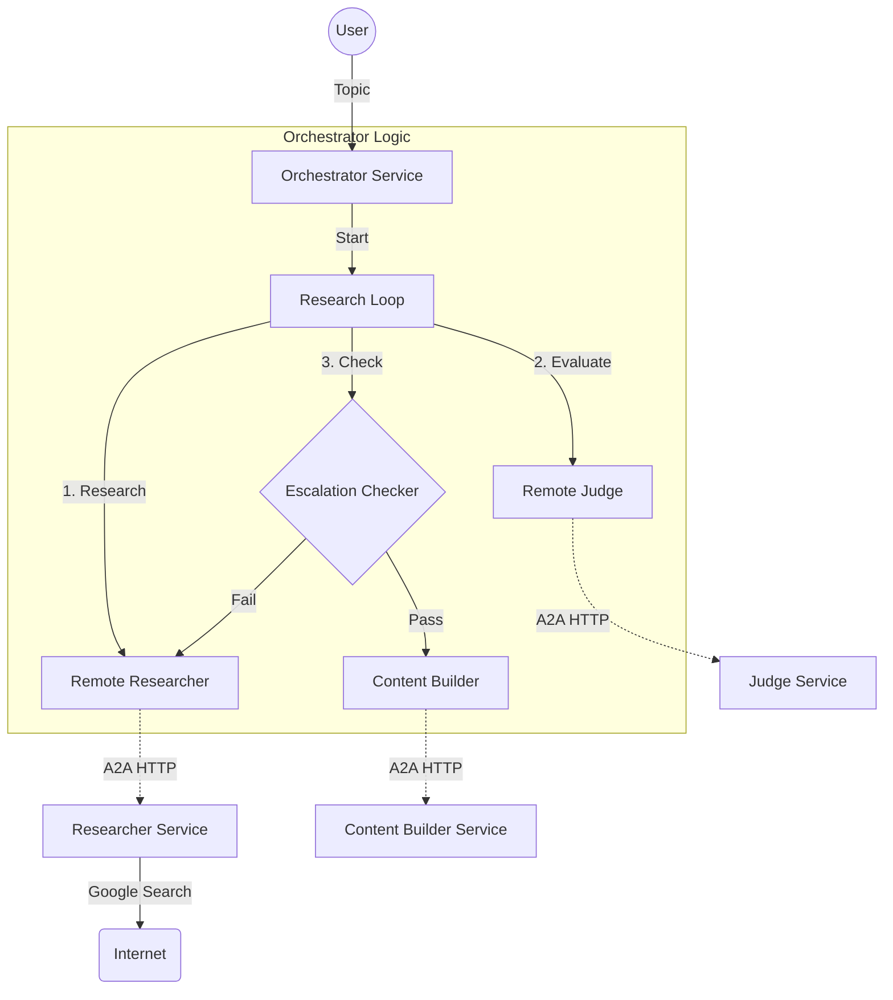

# Developer Guide: Course Creation Agent

Welcome to the Course Creation Agent project! This guide is designed for engineers who want to understand the inner workings of this distributed multi-agent system, contribute to its development, or use it as a reference for building their own A2A-enabled applications.

## 1. System Architecture

This project implements a **distributed multi-agent system** using Google's Agent Development Kit (ADK) and the Agent-to-Agent (A2A) protocol. Unlike a monolithic agent, this system is composed of four independent microservices that collaborate to achieve a goal.

### High-Level Workflow

The system follows a "Research -> Judge -> Build" pipeline, orchestrated by a central service.



### Key Components

1.  **Orchestrator (`orchestrator/`)**:
    *   **Role**: The "brain" of the operation. It does not perform the actual work but manages the flow of information.
    *   **Implementation**: Uses `SequentialAgent` to chain the loop and the builder. Uses `LoopAgent` to manage the research/judge cycle.
    *   **State Management**: Captures outputs from remote agents and stores them in the session state (`ctx.session.state`) to pass context to subsequent agents.

2.  **Researcher (`researcher/`)**:
    *   **Role**: Gathers information.
    *   **Capabilities**: Equipped with the `google_search` tool.
    *   **Type**: Standard `LlmAgent`.

3.  **Judge (`judge/`)**:
    *   **Role**: Quality assurance. Evaluates the researcher's output against the user's request.
    *   **Output**: Returns a structured JSON response (or text containing JSON) with a `status` of "pass" or "fail".

4.  **Content Builder (`content_builder/`)**:
    *   **Role**: Final assembly. Takes the approved research and formats it into a structured course.

---

## 2. Core Concepts & Education

If you are new to the Agent Development Kit (ADK) or distributed systems, this section explains the "Why" and "How" behind this architecture.

### Why Microservices?

In a traditional "Monolithic" agent, all tools and logic reside in a single Python process. While simple to start, this becomes hard to scale.

*   **Scalability**: In this project, the `Researcher` might be doing heavy compute or network I/O. By running it as a separate Cloud Run service, we can scale it independently (e.g., run 100 researchers for 1 orchestrator) without duplicating the Orchestrator logic.
*   **Fault Isolation**: If the `Content Builder` crashes due to a bad template, it doesn't take down the `Orchestrator`. The Orchestrator can simply retry or report the error.
*   **Independent Deployment**: You can update the `Judge`'s prompt to be stricter and redeploy just that service without touching the rest of the system.

### Understanding the A2A Protocol

The **Agent-to-Agent (A2A)** protocol is the standard that allows these independent agents to talk. It's not just a raw HTTP request; it's a handshake.

1.  **Discovery**: When the Orchestrator connects to `https://researcher-url`, it first fetches the **Agent Card** (at `/.well-known/agent.json`).
2.  **Handshake**: The Orchestrator learns what the Researcher *is* (its name, description) and what it *can do* (its input schema).
3.  **Execution**: The Orchestrator sends a task. The Researcher executes it (using its own local tools like Google Search) and returns the result.

This abstraction means the Orchestrator doesn't need to know *how* the Researcher works (e.g., does it use Gemini 1.5 or 2.0? Does it use Bing or Google?). It just knows "I send a query, I get research."

### ADK Primitives Explained

This project uses three fundamental agent types from the ADK:

1.  **`LlmAgent`** (Used in Leaf Agents):
    *   The standard "Thinker". It takes a user prompt, consults its system instructions, selects tools, and generates a response.
    *   *Example*: The `Researcher` is an `LlmAgent` that decides when to call `google_search`.

2.  **`LoopAgent`** (Used in Orchestrator):
    *   A control-flow agent. It repeats a set of sub-agents until a condition is met.
    *   *Example*: The `research_loop` runs `[Researcher -> Judge -> EscalationChecker]` repeatedly.

3.  **`SequentialAgent`** (Used in Orchestrator):
    *   A linear pipeline. It runs a list of agents one after another.
    *   *Example*: The `root_agent` runs `[research_loop -> content_builder]`.

### State Management

In a distributed system, "Memory" is tricky. We use the **Session State** (`ctx.session.state`) as a shared blackboard.

*   When the **Researcher** finishes, we grab its output and save it to `state['research_findings']`.
*   When the **Judge** starts, it looks at `state['research_findings']` to know what to evaluate.
*   This data is passed over the network via A2A, so we keep it text-based (JSON strings).

---

## 3. Getting Started

### Prerequisites

*   **Python 3.10+**
*   **uv**: We use `uv` for fast package management.
    ```bash
    curl -LsSf https://astral.sh/uv/install.sh | sh
    ```
*   **Google Cloud SDK**: Required for authentication and deployment.
*   **Gemini API Key** (for local dev) or **Vertex AI** (for cloud).

### Installation

1.  **Clone the repo** and navigate to the root.
2.  **Install dependencies**:
    ```bash
    make install
    ```
    This will create a virtual environment and install all required packages defined in `pyproject.toml`.

### Running Locally

Running a distributed system locally requires starting multiple processes. We provide a helper script to make this easy.

1.  **Start the Backend Services**:
    ```bash
    make run-local
    ```
    This script (`run_locally.sh`) spins up 4 background processes:
    *   Researcher (Port 8001)
    *   Judge (Port 8002)
    *   Content Builder (Port 8003)
    *   Orchestrator (Port 8000)

2.  **Start the Playground (Optional)**:
    If you want to interact with the Orchestrator via the ADK web UI:
    ```bash
    make playground
    ```
    *Note: Ensure `make run-local` is running in a separate terminal so the remote agents are available.*

---

## 4. Codebase Deep Dive

### Orchestrator Logic (`orchestrator/app/agent.py`)

This file contains the core logic for tying the system together.

*   **`RemoteA2aAgent`**: This class is used to represent the external services.
    ```python
    researcher = RemoteA2aAgent(
        name="researcher",
        agent_card=researcher_url, # URL to the .well-known/agent.json
        ...
    )
    ```
    It acts as a proxy. When the orchestrator "calls" the researcher, this class handles the A2A handshake and HTTP request to the actual Researcher Service.

*   **`create_save_output_callback`**: A critical utility. Since `RemoteA2aAgent` is just a proxy, we need a way to capture the *result* of the remote call and make it available to the next agent (e.g., the Judge needs to see what the Researcher found).
    ```python
    after_agent_callback=create_save_output_callback("research_findings")
    ```
    This saves the text response into `ctx.session.state["research_findings"]`.

*   **`EscalationChecker`**: A custom `BaseAgent` that inspects the session state.
    ```python
    feedback = ctx.session.state.get("judge_feedback")
    if feedback.get("status") == "pass":
        yield Event(..., actions=EventActions(escalate=True))
    ```
    If the judge approves, this agent emits an `escalate=True` action, which signals the `LoopAgent` to break the loop and proceed to the Content Builder.

### Leaf Agents (`researcher/`, `judge/`, `content_builder/`)

These are simpler. They follow the standard ADK `App` pattern.

*   **`app/agent.py`**: Defines the `LlmAgent`, its model (e.g., `gemini-2.5-flash`), instructions, and tools.
*   **`app/server.py`**: Standard FastAPI boilerplate to serve the agent.

---

## 5. Development Workflow

### Adding a New Agent

1.  **Duplicate** an existing agent folder (e.g., `cp -r researcher reviewer`).
2.  **Update `agent.py`**: Change the name, instructions, and tools.
3.  **Update `Makefile`**: Add the new agent to the `run-local` script (or `run_locally.sh`).
4.  **Register in Orchestrator**:
    *   Add a new `RemoteA2aAgent` definition in `orchestrator/app/agent.py`.
    *   Add it to the `sub_agents` list of the appropriate parent agent (Sequential or Loop).

### Modifying Instructions

*   Edit the `instruction` string in `app/agent.py` of the respective service.
*   **Tip**: For the Judge, ensure the instruction explicitly tells it to output JSON if you rely on structured parsing in the Orchestrator.

### Debugging

*   **Logs**: When running `make run-local`, output from all agents is piped to the terminal. Look for `[researcher]`, `[judge]`, etc., prefixes.
*   **State Inspection**: In the Orchestrator's `create_save_output_callback`, there is a print statement:
    ```python
    print(f"[{ctx.agent_name}] Saved output to state['{key}']")
    ```
    Use this to verify data is passing correctly between agents.

---

## 6. Deployment

We deploy to **Google Cloud Run**.

1.  **Deploy Leaf Agents**: Deploy Researcher, Judge, and Content Builder first. They don't depend on anything.
2.  **Get URLs**: Note the HTTPS URLs assigned by Cloud Run.
3.  **Deploy Orchestrator**: Deploy the Orchestrator, passing the leaf agent URLs as environment variables:
    *   `RESEARCHER_AGENT_CARD_URL`
    *   `JUDGE_AGENT_CARD_URL`
    *   `CONTENT_BUILDER_AGENT_CARD_URL`

See `DEPLOYMENT_GUIDE.md` for the exact `gcloud` commands.
